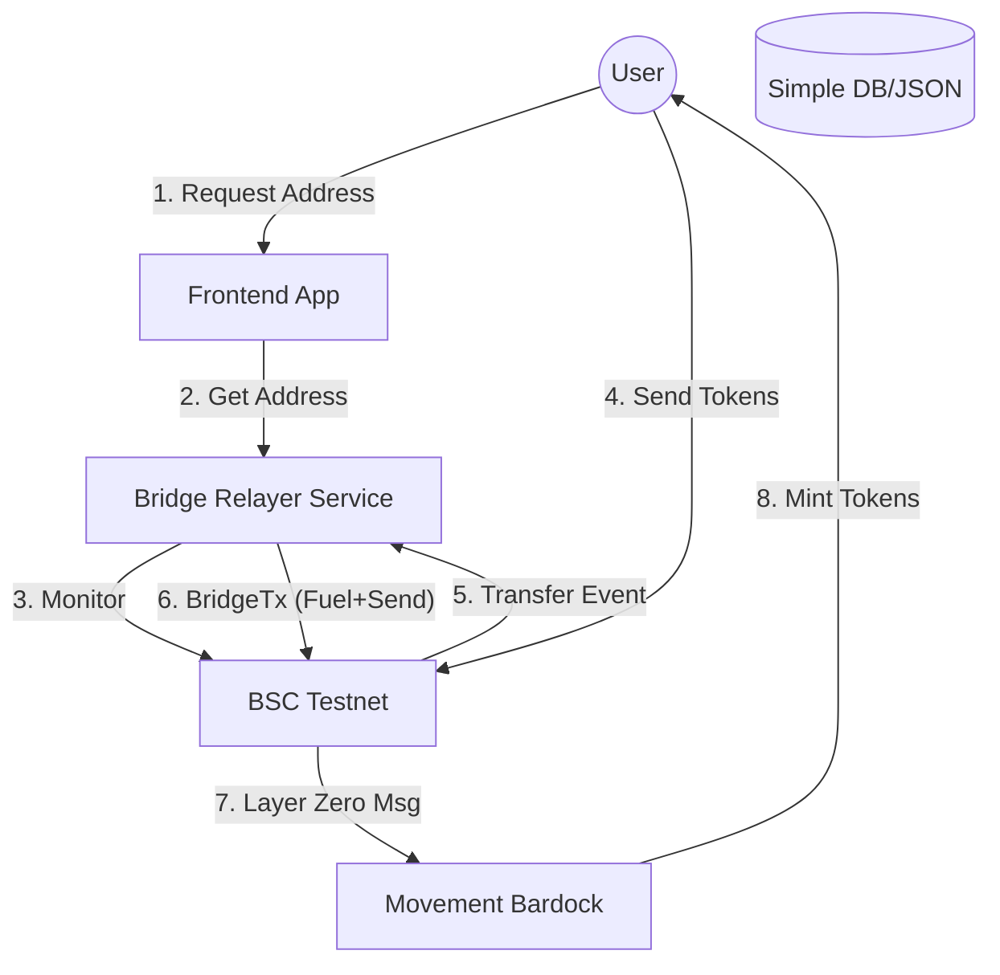

# Bridge Implementation Plan: Deposit Address Flow

## Overview
This document outlines the research and implementation plan for enabling users to bridge funds to the Movement Bardock Testnet by simply sending tokens to a specific **Deposit Address** on the Binance Smart Chain (BSC) Testnet.

## Architecture

### System Components
We will use a **Microservice Architecture** where the Relayer is a separate service alongside your frontend.



### File Structure Proposal
We will create a new directory `bridge_relayer` in your project root to keep concerns separated.

```text
/home/antony/movedapp/
├── move_giftcards_frontend/   # (Existing) Your React App
├── sources/                   # (Existing) Move Contracts
├── bridge_relayer/            # (New) The Backend Service
│   ├── src/
│   │   ├── index.ts           # Entry point / API Server
│   │   ├── listener.ts        # Watches BSC for incoming transfers
│   │   ├── bridge.ts          # Handles LayerZero interactions
│   │   └── utils.ts           # Key management & helpers
│   ├── .env                   # Private keys & Config
│   └── package.json
└── db.json                    # (New) Simple flat-file DB to map User <-> DepositAddr
```

## Detailed Flow

### Phase 1: Address Assignment
1.  **Frontend**: User visits "Bridge" page.
2.  **Frontend**: Calls Relayer API `GET /api/deposit-address?userWallet=0x...`
3.  **Relayer**:
    *   Checks `db.json`.
    *   If exists, return existing Deposit Address.
    *   If new, generate new Keypair (EOA), save to `db.json`, and return public key.
4.  **Frontend**: Displays the Deposit Address QRCode.

### Phase 2: Detecting & Bridging
1.  **User**: Sends 10 Mock USDC to `DepositAddress`.
2.  **Relayer (Listener)**:
    *   Polls BSC Testnet for `Transfer` events to any address in `db.json`.
    *   Detects `+10 Mock USDC`.
3.  **Relayer (Executor)**:
    *   Calculates gas needed for LayerZero.
    *   Sends `0.005 BNB` (Gas) from Hot Wallet -> `DepositAddress`.
    *   Triggers `DepositAddress` to call `MockToken.send(...)` to LayerZero.
4.  **Bardock**: User receives tokens ~60s later.

## Specific Token & Contract Details
*   **Source Chain**: BSC Testnet (Chain ID: 97)
*   **Destination Chain**: Movement Bardock Testnet (Chain ID: 250)
*   **LayerZero Endpoint ID (BSC Testnet)**: `40102` (V2) or `10102` (V1) - *Verify specific contract version.*
*   **Mock Token Contract (BSC)**: `0x3D40fF7Ff9D5B01Cb5413e7E5C18Aa104A6506a5` (Mock Move/USDC)

## Relayer Logic (The "Sweeper")
Since the User's Deposit Address has tokens but **no BNB for gas**, the backend must handle the transaction fee.

**Pattern: Fuel & Forward**
1.  **Detect Deposit**: Listener sees +100 Tokens at `UserDepositAddr`.
2.  **Estimate Gas**: Calculate BNB needed for `approve()` + `send()`.
3.  **Fuel**: Relayer sends `X` BNB to `UserDepositAddr`.
4.  **Execute**: Backend (using `UserDepositAddr` private key) calls:
    *   `token.approve(WrapperAddress, amount)`
    *   `wrapper.send{value: nativeFee}(...)` to Bardock.

## Security & Risks
*   **Hot Wallet**: The Relayer needs a private key with real BNB. Keep this balance low.
*   **Key Storage**: For this MVP, we will store Deposit Address private keys in a local JSON/Env. In production, use a secure KMS (AWS/GCP).
